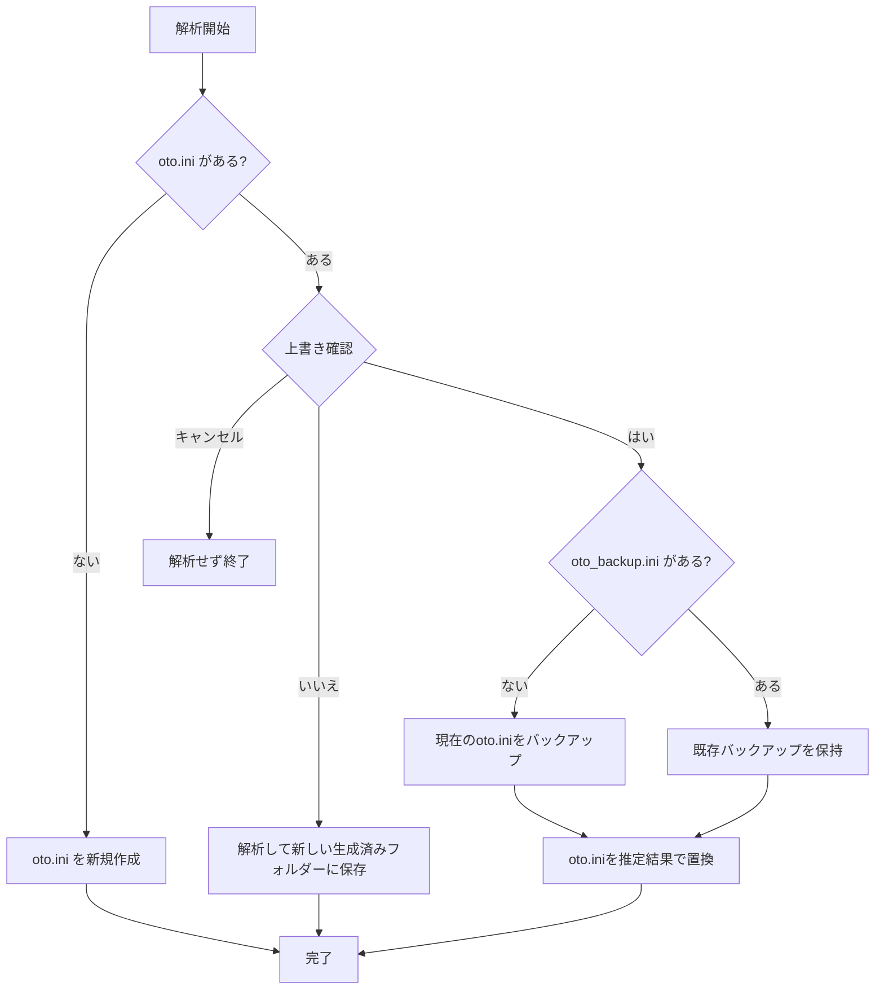

# 使い方

## 起動

配布ファイルは[GitHub Releases](https://github.com/abschan-dayo/UTAU-Oto-Automation/releases)から取得します。

- Windowsでは `Autoto-CPU.exe` または `Autoto-CUDA.exe` を起動します。
- Apple Silicon Macでは `Autoto.dmg` を開き、中の `Autoto.app` をApplicationsへドラッグしてから起動します。Intel Macには対応していません。

macOS版はDeveloper ID署名・Apple公証を行っていません。GUI画面の操作確認も未実施です。

## 音源フォルダーを選ぶ

1. WAVが入った音源フォルダーを「フォルダーを選択」で指定します。画面のドロップ領域にフォルダーをドラッグして指定することもできます。
2. 使用する解析方式を1つ以上選びます。
3. 「解析を開始」を押します。
4. 完了したら、音源フォルダーに作成された `oto.ini` を原音設定エディタで確認してください。

## 入力音声の扱い

解析開始前に入力WAVの扱いを選択します。

- **変換せずに解析**：WAVファイルを標準形式へ一括変換せずに解析します。画像認識・音素位置解析はモデル仕様に合わせ、読み込み時に内部で44.1 kHzへリサンプリングします。
- **44.1 kHz・16 bit相当・Monoに変換して解析**：全方式向けにメモリ上で形式をそろえてから解析します。

どちらを選んでも `oto.ini` を生成できます。元のWAVファイルは変更しません。どちらの方法でも、ステレオ音声は解析用に左右チャンネルを平均してモノラルにします。

## `oto.ini` の上書きとバックアップ

既存の `oto.ini` がある場合、解析開始前に上書き確認を表示します。「はい」を選ぶと推定結果で置き換えます。「いいえ」でも解析を行い、音源フォルダーの親に新しい「生成済み」フォルダーを作って `oto.ini` を保存します。同名フォルダーがある場合は別名のフォルダーを作り、既存の結果を保持します。この場合、音源フォルダー内の解析キャッシュは更新しませんが、操作ログは保存します。キャンセルでは解析を開始しません。初回の上書き時に元の `oto.ini` を `oto_backup.ini` に保存します。すでに `oto_backup.ini` がある場合は保持します。`oto.ini` がなければ新しく作成します。解析中に `oto.ini` が変更された場合は保存を中止し、その変更を保護します。

以前の版が作成した `推定後_oto.ini` は、この処理では削除・上書きしません。

別フォルダーに保存した `oto.ini` も元の音源フォルダーのWAVを対象にしています。元WAVはコピーしません。vLabeler連携では元の音源フォルダーと生成したiniを指定して開きます。

## 進捗とログ

WAV読込・特徴抽出・境界解析はWAVごとに並行して進むため、一つの項目として表示します。完了した工程には緑のチェックが付きます。保存後は「結果を確認」を押してください。

操作ログは音源フォルダー内の `キャッシュ/ログ` に保存します。ファイル名には操作名と日時が入り、「ログを開く」で確認できます。アプリ版・ビルド識別子、GPU名、解析方式ごとの実行先と時間、WAV形式と変換件数、成功・失敗・代用件数を記録します。キャッシュを削除してもログは保持します。絶対パスを含む行は伏せ、例外本文・トレースバックも記録しません。旧AppDataのログフォルダーは、ログ以外のファイルやリンクがなく、通常の権限で削除できる場合のみ整理します。

## 生成した原音設定のクレジット

生成先には `Autoto_クレジットについて.txt` も作成します。同名ファイルがある場合は保持します。生成した `oto.ini` をそのまま公開・配布する場合は、推定に使用したソフトウェアとして「Autoto（開発：ふっきんちゃん）」の表示を必須とします。生成結果を編集して叩き台として使う場合の表示は任意ですが、同様に記載していただけると助かります。

## 結果の確認

生成された原音設定をエディタで確認し、必要に応じて手動で修正してください。信頼度は画面に表示されません。Windows CUDA版はAmpere世代のGPUで動作確認済みです。Blackwell世代など他のGPU構成は未確認です。CUDAが利用できない場合は通知を出してCPUへ切り替えます。
