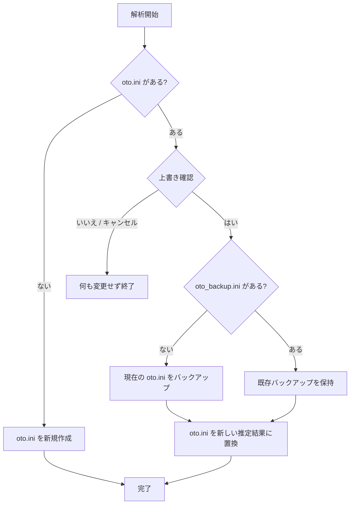

# 使い方

1. Windowsでは `Autoto-CPU.exe` または `Autoto-CUDA.exe`、Apple Silicon Macでは `Autoto.app` を起動します。
2. 「フォルダを選択」でWAVの入った音源フォルダを選びます。
3. 使用する解析方法を選び、「解析を開始」します。完了すると音源フォルダの `oto.ini` に結果が保存されます。
4. 結果を確認し、必要に応じて調整してください。

CUDA版ではNVIDIA GPUと対応ドライバーが必要です。CUDAを使えない場合は通知を出してCPUに切り替えます。macOS版はApple Silicon向けです。

## 入力音声

解析時にWAVを44.1 kHz・16 bit・モノラルへ変換します。形式が異なる場合は、対象ファイル名と変換内容を画面に通知します。変換は解析時のメモリ上で行い、元のWAVファイルは変更しません。ステレオ音声はチャンネルを平均してモノラル化します。

ファイル名には解析可能なかなの録音情報が必要です。

## oto.iniの上書き

既存の `oto.ini` がある場合、解析開始前に上書き確認を表示します。「はい」なら推定結果で置き換え、「いいえ」またはキャンセルなら何も変更せず終了します。元の `oto.ini` は初回のみ `oto_backup.ini` に退避します。既存の `oto_backup.ini` は保持します。`oto.ini` がまだ無ければ、新しく作成します。

古いバージョンが出力した `推定後_oto.ini` は、この処理では削除も上書きもしません。解析対象の元WAVも変更しません。

## 結果について

画面の「信頼度」は推定の曖昧さを示す参考値で、正解率ではありません。動作確認はCUDA版をRTX 3080で実施しています。RTX 5060は未確認です。
