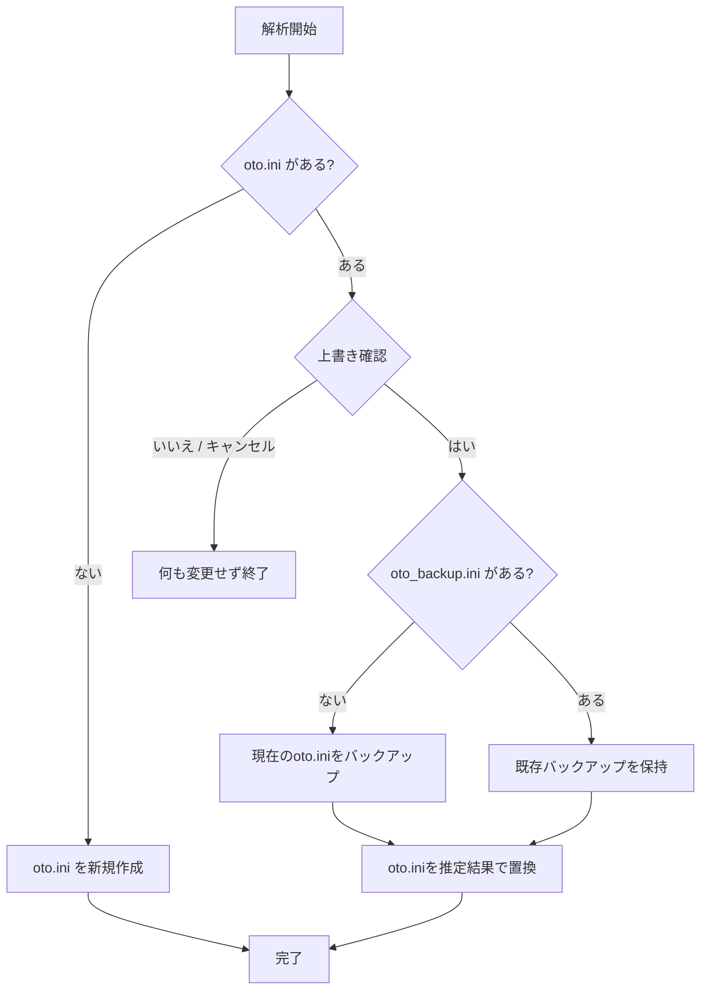

# 使い方

## 起動

配布ファイルは[GitHub Releases](https://github.com/abschan-dayo/UTAU-Oto-Automation/releases)から取得します。

- Windowsでは `Autoto-CPU.exe` または `Autoto-CUDA.exe` を起動します。
- Apple Silicon Macでは `Autoto.dmg` を開き、中の `Autoto.app` をApplicationsへドラッグしてから起動します。Intel Macには対応していません。

macOS版はDeveloper ID署名・Apple公証を行っていません。GUI画面の操作確認も未実施です。

## 音源フォルダーを選ぶ

1. WAVが入った音源フォルダーを「フォルダーを選択」で指定します。画面のドロップ領域にフォルダーをドラッグして指定することもできます。
2. 使用する解析方式を1つ以上選びます。
3. 「解析を開始」を押します。
4. 完了したら、音源フォルダーに作成された `oto.ini` を原音設定エディタで確認してください。

## 入力音声の変換

解析には44.1 kHz・16 bit相当・モノラルの音声を使います。形式が異なるWAVは、対象ファイル名と変換内容を画面に通知し、解析時のメモリ上で変換します。元のWAVファイルは変更しません。ステレオ音声は左右チャンネルを平均してモノラルにします。

## `oto.ini` の上書きとバックアップ

既存の `oto.ini` がある場合、解析開始前に上書き確認を表示します。「はい」を選ぶと推定結果で置き換え、「いいえ」またはキャンセルでは何も変更せず終了します。初回の上書き時に元の `oto.ini` を `oto_backup.ini` に保存します。すでに `oto_backup.ini` がある場合は保持します。`oto.ini` がなければ新しく作成します。解析中に `oto.ini` が変更された場合は保存を中止し、その変更を保護します。

以前の版が作成した `推定後_oto.ini` は、この処理では削除・上書きしません。

## 結果の確認

生成された原音設定をエディタで確認し、必要に応じて手動で修正してください。画面の「信頼度」は推定の曖昧さを示す参考値で、正解率ではありません。Windows CUDA版はRTX 3080で動作確認済みです。RTX 5060（Blackwell）など他のGPU構成は未確認です。CUDAが利用できない場合は通知を出してCPUへ切り替えます。
